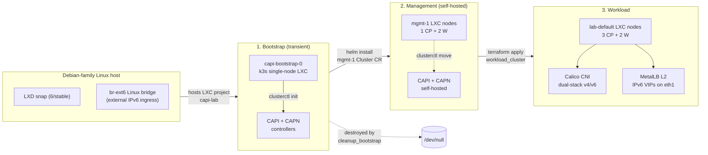

# k8s-lab — Cluster API + LXC/LXD Kubernetes laboratory on Debian-family Linux

[](LICENSE)
[](https://github.com/kogeler/k8s-lab/releases)
[](https://github.com/kogeler/k8s-lab/commits/main)
[](doc/03-stack.md)
[](doc/03-stack.md)
[](doc/03-stack.md)
[](doc/05-prerequisites.md)

> Reusable building blocks for a single-host Kubernetes laboratory on
> Debian-family Linux. LXC/LXD system containers are the Kubernetes nodes,
> the **Cluster API provider for Incus/LXD (CAPN)** drives the cluster
> lifecycle, and every Kubernetes object is delivered as a Helm chart through
> Terraform. A Molecule + Vagrant + libvirt harness exercises the same code
> path on a developer laptop as on production hardware.

---

## What is k8s-lab?

`k8s-lab` is a code repository for building a Kubernetes laboratory on a
**single bare-metal Debian-family Linux host** where the Kubernetes nodes are
unprivileged LXC/LXD system containers, not virtual machines. The cluster
lifecycle is managed end-to-end by Cluster API: a transient single-node `k3s`
bootstrap cluster runs `clusterctl init`, then **pivots** management
responsibility onto a self-hosted management cluster, which then provisions
the actual workload cluster. After the pivot, the bootstrap LXC is destroyed.

The project ships **only reusable building blocks** — Ansible roles, a
Terraform module, Helm charts, and a local test harness. Concrete environment
composition (inventories, secrets, environment-specific tfvars, site-specific
root modules) lives in **separate private consumer repositories** that import
this code. The boundary is a deliberate architectural rule, not a missing
feature.

## Who is this for?

- **Homelab operators** with a single capable bare-metal host who want a real
  multi-CP / multi-worker Kubernetes cluster with a real CNI, a real load
  balancer, and a real CAPI control plane — without paying the VM tax.
- **Cluster API contributors and CAPN users** looking for a reference
  end-to-end pipeline for the LXC/LXD infrastructure provider.
- **Platform engineers** evaluating LXC/LXD as a substrate for ephemeral
  Kubernetes labs or per-developer environments.
- **Educators** running a reproducible single-host CAPI demo.

It is **not** a managed-Kubernetes alternative, a multi-host installer, a
`kind`/`minikube` replacement, or a turnkey "one-command-deploy-to-production"
tool.

## What ships in this repo

- **14 Ansible roles** — host bootstrap, LXD substrate, bootstrap management
  cluster, CAPI/CAPN install, pivot, validation gates, local harness.
- **1 Terraform module** (`terraform/modules/workload_cluster`) — Cluster API
  objects, machine templates, guest networking, cluster add-ons (CNI, MetalLB)
  via the `hashicorp/helm` provider.
- **5 Helm charts** (`charts/`) — `capi-cluster-class`, `capi-workload-cluster`,
  `cni-calico`, `metallb`, `metallb-config`. Every Kubernetes object the
  project creates is delivered through one of these — **no raw manifests, no
  `kubectl apply -f`**.
- **A Molecule + Vagrant + libvirt test harness** that runs the same canonical
  flow on a developer laptop as on the production host.
- **A `Makefile`** that ties the local lifecycle together — `make lint`,
  `make test-local-e2e`, `make deploy-workload`, `make reset-all`,
  `make clean-local`.

## How does the bootstrap → pivot flow work?



See [`doc/02-architecture.md`](doc/02-architecture.md) for the canonical
nine-step flow, the dual-NIC node design, and the Ansible / Terraform / Helm
ownership split.

## Documentation

Start with [`doc/README.md`](doc/README.md) for the full user-facing
documentation. Common entry points:

- [Overview](doc/01-overview.md) — core idea, goals, non-goals.
- [Architecture](doc/02-architecture.md) — bootstrap and pivot flow, dual-NIC
  model, layer ownership, validation gates.
- [Stack](doc/03-stack.md) — every external dependency this repo pins.
- [Quickstart (local)](doc/06-quickstart-local.md) — Vagrant + libvirt local
  end-to-end workflow.
- [Deployment guide](doc/07-deployment-guide.md) — real-host deployment through
  a private consumer repository.
- [Configuration reference](doc/08-configuration-reference.md) — project
  globals, role inputs, Terraform inputs and outputs, chart values.

The architectural source of truth lives under [`plans/`](plans/) — continuous
`§N` numbering across all plan files. The `doc/` chapters summarise and
operationalise those plans for end users.

## Layout

```
ansible/       # 14 reusable roles (host, LXD substrate, bootstrap, pivot, harness)
charts/        # 5 local wrapper Helm charts (CAPI CRs + cluster add-ons)
clusterctl/    # Reserved; runtime clusterctl.yaml is rendered by roles
doc/           # User-facing documentation (chapters 01..14)
plans/         # Architectural plan files (source of truth)
scripts/       # Local automation helpers
terraform/     # workload_cluster module
tests/         # Molecule scenarios + Vagrant harness + Terraform fixtures
LICENSE        # MIT
.artifacts/    # Runtime-only: kubeconfigs, tfvars handoff, ephemeral trust
```

## Local workflows

All entry points are local-only by design. Real-environment composition
(`make deploy TARGET=…`) lives in private consumer repositories.

```bash
make lint                 # static checks: yamllint, ansible-lint, terraform fmt, helm lint
make test-local-harness   # bring up Vagrant VM, verify harness prerequisites
make test-local-e2e       # full local pipeline (plan §13.2)
make deploy-workload      # terraform apply workload cluster on existing mgmt
make reset-all            # full reverse destroy chain (plan §19.2)
make clean-local          # tear down local harness state fast
```

## Conventions

- **Two-NIC node design** — `eth0` = internal dual-stack (default route,
  kubelet node IP, egress); `eth1` = external IPv6-only (ingress, NodePort,
  MetalLB VIP).
- **Unprivileged LXC only** for Kubernetes nodes (plan `§2.8`). Privileged
  LXC is closed by design.
- **Ansible owns** host / bootstrap / harness; **Terraform owns** Cluster API
  objects, guest networking, kube-proxy policy, cluster add-ons (plan `§2.7`).
- **Helm-first delivery** — every Kubernetes object goes through a chart in
  `charts/`. Raw manifests / `kubectl apply -f` are forbidden (plan `§2.9`).
- **Native-first Ansible** — `shell` / `command` / `script` only as a
  documented last-resort fallback (plan `§2.6.1`).
- **Binaries under `/opt/capi-lab`** — no custom APT repositories (plan
  `§2.2`).

## Status

Stage 1 is closed as **v1.0**. The Stage 2 backlog
([`plans/PLAN-stage2-common.md`](plans/PLAN-stage2-common.md)) lists opt-in
items that may be built on top of the working substrate without regressing
it.

## License

`k8s-lab` is licensed under the [MIT License](LICENSE). The license applies
to this repository's code and documentation. Third-party tools, providers,
charts, collections, and container images keep their own licenses.

## Citation

A machine-readable citation file is provided at [`CITATION.cff`](CITATION.cff).
GitHub renders a "Cite this repository" widget on the repo sidebar from it.
